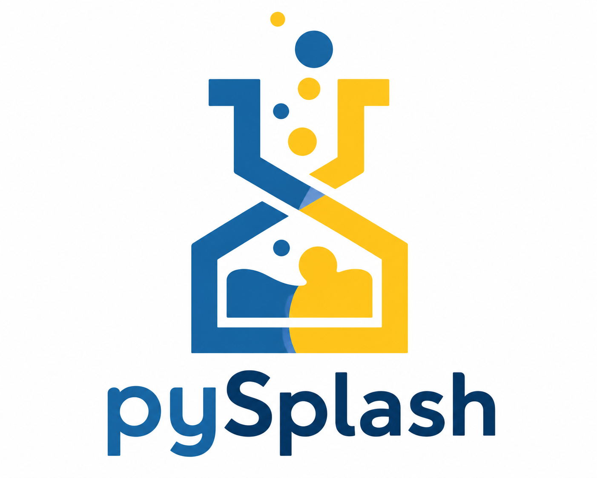

<p align="center">
  
</p>

# pySplash.py v1.0.0

[](https://github.com/Sandeepv68/pySplash.py/blob/master/LICENSE)    

pySplash.py is a simple, Python API wrapper for the popular [Unsplash](https://unsplash.com/) platform. The library is written in **Python**, supports both **sync** (via `requests`) and **async** (via `httpx`) usage, and can be used in any Python 3.9+ project.
Unsplash provides beautiful high quality free images and photos that you can download and use for any project without any attribution.

Before using the Unsplash API, you need to **register as a developer** and **read the API Guidelines.**

> **Note:**  Every application must abide by the [API Guidelines](https://unsplash.com/documentation). Specifically, remember to hotlink images and trigger a download when appropriate.

## Table of Contents
<!--ts-->
* [About](#pysplashpy-v100)
* [Installation](#installation)
* [Sample Usage](#sample-usage)
* [Development](#development)
* [Dependency](#dependency)
* [API Documentation](#api-documentation)
    * [Schema](#schema)
        * [Location](#location)
        * [Summary Objects](#summary-objects)
        * [Error Messages](#error-messages)
    * [Authorization](#authorization)
        * [Public Actions](#public-actions)
        * [User Authentication](#user-authentication)
        * [pySplash.py init()](#pysplashpy-init)
        * [Generate Bearer Token](#generate-bearer-token)
    * [Users APIs](#users-apis)
        * [Get User's Public Profile](#get-users-public-profile)
        * [Get User's Portfolio Link](#get-users-portfolio-link)
        * [Get User's Photos](#get-users-photos)
        * [Get User Liked Photos](#get-user-liked-photos)
        * [Get User's Collections](#get-users-collections)
        * [Get User's Statistics](#get-users-statistics)
    * [Photos APIs](#photos-apis)
        * [List Photos](#list-photos)
        * [List Curated Photos](#list-curated-photos)
        * [Get a Photo by Id](#get-a-photo-by-id)
        * [Get a Random Photo](#get-a-random-photo)
        * [Get a Photo's Statistics](#get-a-photos-statistics)
        * [Get a Photo's Download Link](#get-a-photos-download-link)
        * [Update a Photo](#update-a-photo)
        * [Like a Photo](#like-a-photo)
        * [Unlike a Photo](#unlike-a-photo)
    * [Search APIs](#search-apis)
        * [Search Photos](#search-photos)
        * [Search Collections](#search-collections)
        * [Search Users](#search-users)
    * [Current User APIs](#current-user-apis)
        * [Get the user's profile](#get-users-profile)
        * [Update User's Profile](#update-users-profile)
    * [Stats APIs](#stats-apis)
        * [Totals](#stats-totals)
        * [Months](#stats-month)
    * [Collections APIs](#collections-apis)
        * [Link Relations](#link-relations)
        * [List Collections](#list-collections)
        * [List Featured Collections](#list-featured-collections)
        * [List Curated Collections](#list-curated-collections)
        * [Get a Collection](#get-a-collection)
        * [Get a Curated Collection](#get-a-curated-collection)
        * [Get a Collection's Photos](#get-a-collections-photos)
        * [Get a Curated Collection's Photos](#get-a-curated-collections-photos)
        * [List a Collection's Related Collections](#list-a-collections-related-collections)
        * [Create a New Collection](#create-a-new-collection)
        * [Update an Existing Collection](#update-an-existing-collection)
        * [Delete a Collection](#delete-a-collection)
        * [Add a Photo to a Collection](#add-a-photo-to-a-collection)
        * [Remove a Photo from a Collection](#remove-a-photo-from-a-collection)
* [Tests](#tests)
* [License](#license)
* [Acknowledgements](#acknowledgements)
<!--te-->

## Installation

Install the package from PyPI
```sh
pip install pysplash.py
```

### Sample usage
```python
# Synchronous
from pySplash import PySplashApi

unsplash = PySplashApi()

unsplash.init(bearer_token="<bearer-token>")

result = unsplash.get_photo("<photo-id>")
print(result)
```

```python
# Asynchronous
import asyncio
from pySplash import PySplashApiAsync


async def main():
    unsplash = PySplashApiAsync()
    unsplash.init(bearer_token="<bearer-token>")
    result = await unsplash.get_photo("<photo-id>")
    print(result)


asyncio.run(main())
```

### Development
```sh
pip install requests httpx pytest pytest-asyncio
pytest tests/ -v
```

### Dependency
This library depends on [requests](https://pypi.org/project/requests/) for synchronous HTTP, [httpx](https://pypi.org/project/httpx/) for asynchronous HTTP, and uses Python's built-in `hashlib` for SHA-256 hashing to generate required request headers for the [Unsplash API](https://unsplash.com/documentation).

### API Documentation

### Schema
#### Location
The API we are using is ```https://api.unsplash.com/```. Responses are sent as JSON.

#### Summary objects
When retrieving a list of objects, an abbreviated or summary version of that object is returned - i.e., a subset of its attributes. To get a full detailed version of that object, fetch it individually.

#### Error messages
If an error occurs, whether on the server or client side, the error message(s) will be returned in an ```errors``` array.
For example:
```sh
422 Unprocessable Entity
```
```python
{"errors": ["Username is missing", "Password cannot be blank"]}
```

### Authorization
#### Public Actions
Many actions can be performed without requiring authentication from a specific user. For example, downloading a photo does not require a user to log in.
To authenticate requests in this way, pass your application's access key via the HTTP ```Authorization``` header:
```sh
Authorization: Client-ID YOUR_ACCESS_KEY
```
You can also pass this value using a ```client_id``` query parameter:
```sh
https://api.unsplash.com/photos/?client_id=YOUR_ACCESS_KEY
```
If only your access key is sent, attempting to perform non-public actions that require user authorization will result in a ```401 Unauthorized response```.

#### User Authentication
The Unsplash API uses OAuth2 to authenticate and authorize Unsplash users. Unsplash's OAuth2 paths live at ```https://unsplash.com/oauth/```.

Before using pySplash.py:
- Developers are required to create a developer account from [Unsplash](https://unsplash.com/developers).
- Create a new App from Your Apps page.
- Get the ```Access Key```, ```Secret key```, ```Callback URLs```, and ```Authorization code```.
- If you have a Bearer Token, then its super, or else you can generate it using **pySplash.py**.
> **Note:** ```Authorization code``` can be obtained by clicking the ```Authorize``` link  next to ```Callback URLs```. Also ```Authorization code``` is a one-time use code, you have to generate it again, if the action fails!.

#### pySplash.py init()
pySplash.py instance has to be initialized with your credentials obtained from Unsplash developer account for programatic access. These credentials information are passed in to the `init()` function as keyword arguments. The following example shows all the available options.

```python
from pySplash import PySplashApi

UnsplashApi = PySplashApi()

UnsplashApi.init(
    access_key="<api-key>",
    secret_key="<secret-key>",
    redirect_uri="<callback-url>",
    code="<authorization-code>",
)
```
If you have a `bearer_token`, then only bearer token has to be passed in.
```python
UnsplashApi.init(bearer_token="<bearer-token>")
```

#### Generate Bearer Token
A method to generate a Bearer Token for ```write_access``` to private data.
The ```init()``` method in this case requires `access_key`, `secret_key`, `redirect_uri`, and `code` to generate bearer token.
> **Note:** No Parameters are required for this function.

```python
from pySplash import PySplashApi

UnsplashApi = PySplashApi()

UnsplashApi.init(
    access_key="<api-key>",
    secret_key="<secret-key>",
    redirect_uri="<callback-url>",
    code="<authorization-code>",
)

result = UnsplashApi.generate_bearer_token()
print(result)
```
```python
# Async version
result = await UnsplashApi.generate_bearer_token()
```

If successful, the response body will be a JSON representation of your user's access token a.k.a bearer token:

```sh
{
   "access_token": "091343ce13c8ae780065ecb3b13dc903475dd22cb78a05503c2e0c69c5e98044",
   "token_type": "bearer",
   "scope": "public read_photos write_photos",
   "created_at": 1436544465
 }
```
and once you have your ```bearer_token``` you can use it in your app like this:
```python
UnsplashApi.init(bearer_token="<bearer-token>")
```

### Users APIs
#### Get User's Public Profile
Retrieves public details on a given user.
```
GET /users/:username
```
##### Parameters

| Parameter | Type | Description | Optional | Default |
| ----- | ---- | ----------- | -------- | ------- |
| **username** | *str* | The username of the particular user | no |
| **width** | *int* | Width of the profile picture in pixels | yes |
| **height** | *int* | Height of the profile picture in pixels | yes |

> **Note:**  When optional **height** & **width** are specified the profile image will be included in the "profile_image" object as "custom".

```python
UnsplashApi.get_public_profile("<username>", 600, 600)
```

#### Get User's Portfolio Link
Retrieves a single user's portfolio link.
```
GET /users/:username/portfolio
```
##### Parameters

| Parameter | Type | Description | Optional | Default |
| ----- | ---- | ----------- | -------- | ------- |
| **username** | *str* | The username of the particular user | no |

```python
UnsplashApi.get_user_portfolio("<username>")
```

#### Get User's Photos
Gets a list of photos uploaded by a particular user.
```
GET /users/:username/photos
```
##### Parameters

| Parameter | Type | Description | Optional | Default |
| ----- | ---- | ----------- | -------- | ------- |
| **username** | *str* | The username of the particular user | no |
| **page** | *int* | Page number to retrieve | yes | 1
| **per_page** | *int* | Number of items per page | yes | 10
| **stats** | *bool* | Show the stats for each user's photo | yes | False
| **resolution** | *str* | The frequency of the stats | yes | days
| **quantity** | *int* | The amount of for each stat | yes | 30
| **order_by** | *str* | How to sort the photos.(```Valid values: latest, oldest, popular```) | yes | latest

```python
UnsplashApi.get_user_photos("<username>", 1, 10, False, "days", 30, "latest")
```

#### Get User Liked Photos
Gets a list of photos liked by a user.
```
GET /users/:username/likes
```
##### Parameters

| Parameter | Type | Description | Optional | Default |
| ----- | ---- | ----------- | -------- | ------- |
| **username** | *str* | The username of the particular user | no |
| **page** | *int* | Page number to retrieve | yes | 1
| **per_page** | *int* | Number of items per page | yes | 10
| **order_by** | *str* | How to sort the photos.(```Valid values: latest, oldest, popular```) | yes | latest

```python
UnsplashApi.get_user_liked_photos("<username>", 1, 10, "latest")
```

#### Get User's Collections
Gets a list of collections created by the user.
```
GET /users/:username/collections
```
##### Parameters

| Parameter | Type | Description | Optional | Default |
| ----- | ---- | ----------- | -------- | ------- |
| **username** | *str* | The username of the particular user | no |
| **page** | *int* | Page number to retrieve | yes | 1
| **per_page** | *int* | Number of items per page | yes | 10

```python
UnsplashApi.get_user_collections("<username>", 1, 10)
```

#### Get User's Statistics
Gets a user's account statistics.
```
GET /users/:username/statistics
```

##### Parameters

| Parameter | Type | Description | Optional | Default |
| ----- | ---- | ----------- | -------- | ------- |
| **username** | *str* | The username of the particular user | no |
| **resolution** | *str* | The frequency of the stats | yes | days
| **quantity** | *int* | The amount of for each stat | yes | 30

```python
UnsplashApi.get_user_statistics("<username>", "days", 30)
```

### Photos APIs
#### List Photos
Gets a single page from the list of all photos.
```
GET /photos
```
##### Parameters

| Parameter | Type | Description | Optional | Default |
| ----- | ---- | ----------- | -------- | ------- |
| **page** | *int* | Page number to retrieve | yes | 1
| **per_page** | *int* | Number of items per page | yes | 10
| **order_by** | *str* | How to sort the photos.(```Valid values: latest, oldest, popular```) | yes | latest

```python
UnsplashApi.list_photos(1, 10, "latest")
```

#### List Curated Photos
Gets a single page from the list of the curated photos.
```
GET /photos/curated
```
##### Parameters

| Parameter | Type | Description | Optional | Default |
| ----- | ---- | ----------- | -------- | ------- |
| **page** | *int* | Page number to retrieve | yes | 1
| **per_page** | *int* | Number of items per page | yes | 10
| **order_by** | *str* | How to sort the photos.(```Valid values: latest, oldest, popular```) | yes | latest

```python
UnsplashApi.list_curated_photos(1, 10, "latest")
```

#### Get a Photo by Id
Retrieves a single photo.
```
GET /photos/:id
```
##### Parameters

| Parameter | Type | Description | Optional | Default |
| ----- | ---- | ----------- | -------- | ------- |
| **id** | *str* | The photo's ID | no |
| **width** | *int* | Image width in pixels | yes |
| **height** | *int* | Image height in pixels | yes |
| **rect** | *str* |4 comma-separated integers representing x, y, width, height of the cropped rectangle | yes |
> **Note:** Supplying the optional **width** or **height** parameters will result
in the custom photo URL being added to the urls object:

```python
UnsplashApi.get_photo("<id of the photo>", 500, 500, "0, 0, width, height")
```

#### Get a Random Photo
Retrieves a single random photo, given optional filters.
```
GET /photos/random
```
##### Parameters
> **Note:** All parameters are optional, and can be combined to narrow the pool of photos from which a random one will be chosen.

| Parameter | Type | Description | Optional | Default |
| ----- | ---- | ----------- | -------- | ------- |
| **collections** | *str* | The public collection ID('s) to filter selection. If multiple, comma-separated | yes |
| **featured** | *bool* | Limit selection to featured photos | yes | False
| **username** | *str* | Limit selection to a single user | yes |
| **query** | *str* | Limit selection to photos matching a search term | yes |
| **width** | *int* | The Image width in pixels | yes |
| **height** | *int* | The Image height in pixels | yes |
| **orientation** | *str* | Filter search results by photo orientation. (```Valid values are landscape, portrait, and squarish```) | yes | landscape
| **count** | *int* | The number of photos to return. (```max: 30```) | yes | 1

> **Note:** You can't use the collections and query parameters in the same request.
> When supplying a **count** parameter - and only then - the response will be an array of photos, even if the value of **count** is 1.

```python
UnsplashApi.get_random_photo()
```

#### Get a Photo's Statistics
Retrieves total number of downloads, views and likes of a single photo, as well as the historical breakdown of these stats in a specific timeframe (default is 30 days).
```
GET /photos/:id/statistics
```
##### Parameters

| Parameter | Type | Description | Optional | Default |
| ----- | ---- | ----------- | -------- | ------- |
| **id** | *str* | The photo's ID | no |
| **resolution** | *str* | The frequency of the stats | yes | days
| **quantity** | *int* | The amount of for each stat | yes | 30
> **Note:** Currently, the only resolution param supported is "days". The quantity param can be any number between 1 and 30.

```python
UnsplashApi.get_photo_statistics("<photo-id>", "days", 10)
```

#### Get a Photo's Download Link
Retrieves a single photo's download link. Preferably hit this endpoint if a photo is downloaded in your application for use (example: to be displayed on a blog article, to be shared on social media, to be remixed, etc).
```
GET /photos/:id/download
```
##### Parameters

| Parameter | Type | Description | Optional | Default |
| ----- | ---- | ----------- | -------- | ------- |
| **id** | *str* | The photo's ID | no |
> **Note:** This is different than the concept of a view, which is tracked automatically when you hotlink an image.

```python
UnsplashApi.get_photo_link("<photo-id>")
```

#### Update a Photo
Updates a photo on behalf of the logged-in user. This requires the ```write_photos``` scope and ```bearer_token```.
```
PUT /photos/:id
```
##### Parameters

| Parameter | Type | Description | Optional | Default |
| ----- | ---- | ----------- | -------- | ------- |
| **id** | *str* | The photo's ID | no |
| **location** | *dict* | The location dict holding location data | yes |
| **exif** | *dict* | The exif dict holding exif data | yes |
> **Note:** **Exchangeable image file format** (officially Exif, according to JEIDA/JEITA/CIPA specifications) is a standard that specifies the formats for images, sound, and ancillary tags used by digital cameras (including smartphones), scanners and other systems handling image and sound files recorded by digital cameras. [Readmore](https://en.wikipedia.org/wiki/Exif)

##### location & exif dict keys

| dict[key] | Description |
| ----- | ----------- |
| location[latitude] | The photo location's latitude (Optional) |
| location[longitude] | The photo location's longitude (Optional) |
| location[name] | The photo location's name (Optional) |
| location[city] | The photo location's city (Optional) |
| location[country] | The photo location's country (Optional) |
| location[confidential] | The photo location's confidentiality (Optional) |
| exif[make] | Camera's brand (Optional) |
| exif[model] | Camera's model (Optional) |
| exif[exposure_time] | Camera's exposure time (Optional) |
| exif[aperture_value] | Camera's aperture value (Optional) |
| exif[focal_length] | Camera's focal length (Optional) |
| exif[iso_speed_ratings] | Camera's iso (Optional) |

```python
UnsplashApi.update_photo("<photo-id>", {"country": "INDIA"}, {"make": "Redmi Note 3"})
```

#### Like a Photo
Likes a photo on behalf of the logged-in user. This requires the ```write_likes``` scope.
```
POST /photos/:id/like
```
##### Parameters

| Parameter | Type | Description | Optional | Default |
| ----- | ---- | ----------- | -------- | ------- |
| **id** | *str* | The photo's ID | no |
> **Note:**  This action is idempotent; sending the POST request to a single photo multiple times has no additional effect.

```python
UnsplashApi.like_photo("<photo-id>")
```

#### Unlike a Photo
Removes a user's like of a photo.
```
DELETE /photos/:id/like
```
##### Parameters

| Parameter | Type | Description | Optional | Default |
| ----- | ---- | ----------- | -------- | ------- |
| **id** | *str* | The photo's ID | no |
> **Note:** This action is idempotent; sending the DELETE request to a single photo multiple times has no additional effect.

```python
UnsplashApi.unlike_photo("<photo-id>")
```

### Search APIs
#### Search Photos
Gets a single page of photo results for a particular query.
```
GET /search/photos
```
##### Parameters

| Parameter | Type | Description | Optional | Default |
| ----- | ---- | ----------- | -------- | ------- |
| **query** | *str* | The search query | no |
| **page** | *int* | Page number to retrieve | yes | 1
| **per_page** | *int* | Number of items per page | yes | 10
| **collections** | *str* | Collection ID('s) to narrow search. If multiple, comma-separated. | yes |
| **orientation** | *str* | Filter search results by photo orientation. (```Valid values are landscape, portrait, and squarish.```) | yes | landscape

```python
UnsplashApi.search("cars", 1, 10, "", "landscape")
```

#### Search Collections
Gets a single page of collection results for a query.
```
GET /search/collections
```
##### Parameters

| Parameter | Type | Description | Optional | Default |
| ----- | ---- | ----------- | -------- | ------- |
| **query** | *str* | The search query | no |
| **page** | *int* | Page number to retrieve | yes | 1
| **per_page** | *int* | Number of items per page | yes | 10

```python
UnsplashApi.search_collections("cars", 1, 10)
```

#### Search Users
Gets a single page of user results for a query.
```
GET /search/users
```
##### Parameters

| Parameter | Type | Description | Optional | Default |
| ----- | ---- | ----------- | -------- | ------- |
| **query** | *str* | The search query | no |
| **page** | *int* | Page number to retrieve | yes | 1
| **per_page** | *int* | Number of items per page | yes | 10

```python
UnsplashApi.search_users("<search-keyword>", 1, 10)
```

### Current User APIs
#### Get User's Profile
Gets the current User's profile. To access a user's private data, the user is required to authorize the ```read_user``` scope. Without it, this request will return a ```403 Forbidden response```.
```
GET /me
```
> **Note:** No Parameters are required.

> **Note:**  Without a Bearer token (i.e. using a ```Client-ID token```) this request will return a ```401 Unauthorized``` response.

```python
UnsplashApi.get_current_user_profile()
```

#### Update User's Profile
Updates the current User's profile.
```
PUT /me
```
##### Parameters

| Parameter | Type | Description | Optional | Default |
| ----- | ---- | ----------- | -------- | ------- |
| username | *str* | The username of the current user | yes |
| first_name | *str* | The first name of the current user | yes |
| last_name | *str* | The last name of the current user | yes |
| email | *str* | The email id of the current user | yes |
| url | *str* | The Portfolio/personal URL of the current user | yes |
| location | *str* | The location of the current user | yes |
| bio | *str* | The About/bio of the current user | yes |
| instagram_username | *str* | The Instagram username of the current user | yes |
> **Note:** This action requires the ```write_user scope```. Without it, it will return a ```403 Forbidden response```.

```python
UnsplashApi.update_current_user_profile(
    "<username>", "<first_name>", "<last_name>", "<email>", "<url>", "<location>", "<bio>", "<instagram_username>"
)
```

### Stats APIs
#### Stats Totals
Gets a list of counts for all of Unsplash.
```
GET /stats/total
```
```python
UnsplashApi.get_stats_totals()
```
#### Response
```sh
200 OK
```
```sh
{
  "total_stats": {
    "photos": 10000,
    "downloads": 2000,
    "views": 5000,
    "likes": 800,
    "photographers": 100,
    "pixels": 200000,
    "downloads_per_second": 10,
    "views_per_second": 20,
    "developers": 20,
    "applications": 50,
    "requests": 8000
  }
}
```
#### Stats Month
Gets the overall Unsplash stats for the past 30 days.
```
GET /stats/month
```
```python
UnsplashApi.get_stats_month()
```
#### Response
```sh
200 OK
```
```sh
{
  "month_stats": {
    "downloads": 20,
    "views": 200,
    "likes": 60,
    "new_photos": 10,
    "new_photographers": 5,
    "new_pixels": 2000,
    "new_developers": 8,
    "new_applications": 5,
    "new_requests": 100
  }
}
```

### Collections APIs
#### Link Relations
Collections have the following link relations:

| rel | Description |
| --- | ----------- |
| ```self``` | API location of this collection |
| ```html``` | HTML location of this collection |
| ```photos``` | API location of this collection's photos |
| ```related``` | API location of this collection's related collections (Non-curated collections only) |
| ```download``` | Download location of this collection's zip file (Curated collections only) |

#### List Collections
Gets a single page from the list of all collections.
```
GET /collections
```
##### Parameters

| Parameter | Type | Description | Optional | Default |
| ----- | ---- | ----------- | -------- | ------- |
| **page** | *int* | Page number to retrieve | yes | 1
| **per_page** | *int* | Number of items per page | yes | 10
```python
UnsplashApi.list_collections()
```

#### List Featured Collections
Gets a single page from the list of featured collections.
```
GET /collections/featured
```
##### Parameters

| Parameter | Type | Description | Optional | Default |
| ----- | ---- | ----------- | -------- | ------- |
| **page** | *int* | Page number to retrieve | yes | 1
| **per_page** | *int* | Number of items per page | yes | 10
```python
UnsplashApi.list_featured_collections()
```

#### List Curated Collections
Gets a single page from the list of curated collections.
```
GET /collections/curated
```
##### Parameters

| Parameter | Type | Description | Optional | Default |
| ----- | ---- | ----------- | -------- | ------- |
| **page** | *int* | Page number to retrieve | yes | 1
| **per_page** | *int* | Number of items per page | yes | 10
```python
UnsplashApi.list_curated_collections()
```

#### Get a Collection
Retrieves a single collection. To view a user's private collections, the ```read_collections``` scope is required.
```
GET /collections/:id
```
##### Parameters

| Parameter | Type | Description | Optional | Default |
| ----- | ---- | ----------- | -------- | ------- |
| **id** | *str* | The Collection ID | no |
```python
UnsplashApi.get_collection("<collection-id>")
```

#### Get a Curated Collection
Retrieves a single curated collection. To view a user's private collections, the ```read_collections``` scope is required.
```
GET /collections/curated/:id
```
##### Parameters

| Parameter | Type | Description | Optional | Default |
| ----- | ---- | ----------- | -------- | ------- |
| **id** | *str* | The Collection ID | no |
```python
UnsplashApi.get_curated_collection("<curated-collection-id>")
```

#### Get a Collection's Photos
Retrieves a collection's photos.
```
GET /collections/:id/photos
```
##### Parameters

| Parameter | Type | Description | Optional | Default |
| ----- | ---- | ----------- | -------- | ------- |
| **id** | *str* | The Collection ID | no |
| **page** | *int* | Page number to retrieve | yes | 1
| **per_page** | *int* | Number of items per page | yes | 10
```python
UnsplashApi.get_collection_photos("<collection-id>", 1, 10)
```

#### Get a Curated Collection's Photos
Retrieves a curated collection's photos.
```
GET /collections/curated/:id/photos
```
##### Parameters

| Parameter | Type | Description | Optional | Default |
| ----- | ---- | ----------- | -------- | ------- |
| **id** | *str* | The Collection ID | no |
| **page** | *int* | Page number to retrieve | yes | 1
| **per_page** | *int* | Number of items per page | yes | 10
```python
UnsplashApi.get_curated_collection_photos("<curated-collection-id>", 1, 10)
```

#### List a Collection's Related Collections
Retrieves a list of collections related to this one.
```
GET /collections/:id/related
```
##### Parameters

| Parameter | Type | Description | Optional | Default |
| ----- | ---- | ----------- | -------- | ------- |
| **id** | *str* | The Collection ID | no |
```python
UnsplashApi.list_related_collections("<collection-id>")
```

#### Create a New Collection
Creates a new collection. This requires the ```write_collections``` scope.
```
POST /collections
```
##### Parameters

| Parameter | Type | Description | Optional | Default |
| ----- | ---- | ----------- | -------- | ------- |
| **title** | *str* | The title of the collection | no |
| **description** | *str* | The collection's description | yes |
| **private** | *bool* | Whether to make this collection private | yes | False
```python
UnsplashApi.create_collection("<collection-name>", "<description>", False)
```

#### Update an Existing Collection
Updates an existing collection belonging to the logged-in user. This requires the ```write_collections``` scope.
```
PUT /collections/:id
```
##### Parameters

| Parameter | Type | Description | Optional | Default |
| ----- | ---- | ----------- | -------- | ------- |
| **id** | *str* | The collection id | no |
| **title** | *str* | The title of the collection | yes |
| **description** | *str* | The collection's description | yes |
| **private** | *bool* | Whether to make this collection private | yes | False
```python
UnsplashApi.update_collection("<collection-id>", "<collection-name>", "<description>", False)
```

#### Delete a Collection
Deletes a collection belonging to the logged-in user. This requires the ```write_collections``` scope.
```
DELETE /collections/:id
```
##### Parameters

| Parameter | Type | Description | Optional | Default |
| ----- | ---- | ----------- | -------- | ------- |
| **id** | *str* | The Collection ID | no |
```python
UnsplashApi.delete_collection("<collection-id>")
```

#### Add a Photo to a Collection
Adds a photo to one of the logged-in user's collections. Requires the ```write_collections``` scope.
```
POST /collections/:collection_id/add
```
##### Parameters

| Parameter | Type | Description | Optional | Default |
| ----- | ---- | ----------- | -------- | ------- |
| **collection_id** | *str* | The Collection ID | no |
| **photo_id** | *str* | The Photo ID | no |
> **Note:**  If the photo is already in the collection, this action has no effect.

```python
UnsplashApi.add_photo_to_collection("<collection-id>", "<photo-id>")
```

#### Remove a Photo from a Collection
Removes a photo from one of the logged-in user's collections. Requires the ```write_collections``` scope.
```
DELETE  /collections/:collection_id/remove
```
##### Parameters

| Parameter | Type | Description | Optional | Default |
| ----- | ---- | ----------- | -------- | ------- |
| **collection_id** | *str* | The Collection ID | no |
| **photo_id** | *str* | The Photo ID | no |
```python
UnsplashApi.remove_photo_from_collection("<collection-id>", "<photo-id>")
```

### Tests
pySplash.py uses `pytest` and `pytest-asyncio` as the testing environment. Test files are available in the `tests/` folder.

```sh
pip install pytest pytest-asyncio
pytest tests/ -v
```

### License
The MIT License

Copyright (c) 2018- Sandeep Vattapparambil, http://www.sandeepv.in

Permission is hereby granted, free of charge, to any person obtaining a copy
of this software and associated documentation files (the "Software"), to deal
in the Software without restriction, including without limitation the rights
to use, copy, modify, merge, publish, distribute, sublicense, and/or sell
copies of the Software, and to permit persons to whom the Software is
furnished to do so, subject to the following conditions:

The above copyright notice and this permission notice shall be included in
all copies or substantial portions of the Software.

THE SOFTWARE IS PROVIDED "AS IS", WITHOUT WARRANTY OF ANY KIND, EXPRESS OR
IMPLIED, INCLUDING BUT NOT LIMITED TO THE WARRANTIES OF MERCHANTABILITY,
FITNESS FOR A PARTICULAR PURPOSE AND NONINFRINGEMENT. IN NO EVENT SHALL THE
AUTHORS OR COPYRIGHT HOLDERS BE LIABLE FOR ANY CLAIM, DAMAGES OR OTHER
LIABILITY, WHETHER IN AN ACTION OF CONTRACT, TORT OR OTHERWISE, ARISING FROM,
OUT OF OR IN CONNECTION WITH THE SOFTWARE OR THE USE OR OTHER DEALINGS IN
THE SOFTWARE.


### Acknowledgements
Thanks, and Kudos to team [Unsplash](https://unsplash.com/) for creating a wonderful platform for sharing
beautiful high quality free images and photos.

Made with :heart: by [Sandeep Vattapparambil](https://github.com/Sandeepv68).
